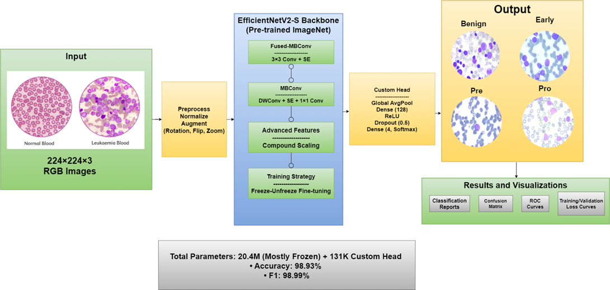
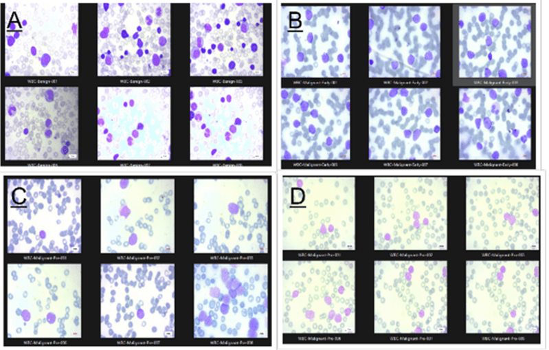

# Leukemia-Diagnosis-EfficientNetV2-vs-CNNs



## Overview
This project implements and compares two deep learning models for automated detection and classification of leukemia cells from microscopic images:

- **Enhanced EfficientNetV2-S Model**: A transfer learning approach using a pre-trained model with custom classification layers.
- **Traditional CNN Model**: A lightweight convolutional neural network built from scratch.

## Dataset
The project uses the ALL (Acute Lymphoblastic Leukemia) dataset containing 3,256 cell images across four classes:
- **Benign**: 504 images (normal lymphocytes)
- **Early**: 985 images (early-stage leukemia cells)
- **Pre**: 963 images (pre-cancerous leukemia cells)
- **Pro**: 804 images (progressive/proliferative leukemia cells)


*Leukemia Types: (A) Benign, (B) Early-stage, (C) Pre-cancerous, (D) Progressive (Proliferative)*

## Installation
1. Clone the repository:
   ```bash
   git clone https://github.com/divyanshupatel17/Leukemia-Diagnosis-EfficientNetV2-vs-CNNs.git
   ```
2. Navigate to the project directory:
   ```bash
   cd Leukemia-Diagnosis-EfficientNetV2-vs-CNNs
   ```
3. Install the required dependencies:
   ```bash
   pip install -r requirements.txt
   ```

## Project Structure
```
├── data/                          # Dataset directory
│   ├── ALL_dataset/               # Original ALL dataset
│   │   ├── Benign/                # 504 normal lymphocyte images
│   │   ├── Early/                 # 985 early-stage leukemia cell images
│   │   ├── Pre/                   # 963 pre-cancerous leukemia cell images
│   │   └── Pro/                   # 804 progressive leukemia cell images
│   ├── cnn_model/                 # Processed data for CNN model
│   └── efficientnet_model/        # Processed data for EfficientNetV2
├── docs/                          # Documentation
│   ├── assets/                    # Project assets
│   │   ├── figures/               # Model diagrams and plots
│   │   ├── tables/                # Performance metrics tables
│   └── report/                    # Project reports and papers
│       ├── A1F2_10_REFERENCES_PAPER/   # Reference papers used in the project
│       ├── A1F2_10_SOURCE_FILE_LINKS/  # Links to source files and resources
│       ├── A1F2_10_FINAL_PAPER/        # Final project report
│       └── A1F2_10_BASEPAPER/          # Base research papers for the project
├── models/                        # Model implementations
│   ├── cnn_model/                 # Traditional CNN implementation
│   │   ├── config.py             # Model configuration
│   │   ├── models/               # Model architecture
│   │   ├── scripts/              # Training and evaluation scripts
│   │   └── results/              # Training results and metrics
│   ├── efficientnet_model/       # EfficientNetV2 implementation
│   │   ├── config.py             # Model configuration
│   │   ├── models/               # Model architecture
│   │   ├── scripts/              # Training and evaluation scripts
│   │   └── results/              # Training results and metrics
│   └── saved_models/             # Trained model weights
│       ├── efficientnetv2s_leukemia_model.h5  # Trained EfficientNetV2 model
│       └── cnn_leukemia_model.h5              # Trained CNN model
├── utils/                         # Utility functions
│   ├── compare_models.py         # Model comparison tools
│   ├── find_sample_images.py     # Image sampling utilities
│   └── test_model_loading.py     # Model loading tests
├── visualization/                 # Visualization tools
│   ├── gradcam/                  # Grad-CAM implementation
│   ├── gradcam_figures/          # Grad-CAM visualizations
│   └── model_diagrams/           # Model architecture diagrams
├── requirements.txt              # Project dependencies
└── run_guide.py                  # Interactive execution guide
```

## Usage
1. Run the interactive guide to execute different components:
   ```bash
   python run_guide.py
   ```
2. The guide provides options for:
   - Training models
   - Evaluating model performance
   - Generating visualizations
   - Comparing model results

## Project Results

### Model Performance Comparison

| Model | Accuracy | Precision | Recall | F1-Score | Training Time |
|-------|----------|-----------|--------|----------|---------------|
| EfficientNetV2-S | 98.93% | 98.95% | 98.93% | 98.93% | 1.5 hours |
| Traditional CNN | 89.42% | 89.55% | 89.42% | 89.40% | 45 minutes |

### Key Findings

1. **Superior Transfer Learning Performance**: The EfficientNetV2-S model with transfer learning significantly outperformed the traditional CNN in all metrics, demonstrating the effectiveness of leveraging pre-trained weights for medical image classification tasks.

2. **Class-wise Performance**: Both models performed best on the "Benign" class with nearly perfect accuracy, while "Early" and "Pre" classes were more challenging to distinguish due to their visual similarities.

3. **Resource Efficiency**: Despite its superior performance, the EfficientNetV2-S model required more computational resources and training time compared to the traditional CNN.

4. **Inference Speed**: The traditional CNN model, while less accurate, offers faster inference times, making it potentially suitable for resource-constrained environments.

5. **Attention Visualization**: Grad-CAM visualizations revealed that the EfficientNetV2-S model focuses on clinically relevant features in the cell images, aligning with pathological criteria used by hematologists.

## Model Details

### Enhanced EfficientNetV2-S
- Transfer learning with pre-trained EfficientNetV2-S
- Custom classification layers
- Achieved 98.93% accuracy
- Superior feature extraction capabilities

### Traditional CNN
- Custom-built lightweight architecture
- Achieved 89.42% accuracy
- Baseline model for comparison

## Visualization Tools

### Grad-CAM Visualization
- Implemented in `visualization/gradcam/`
- Reveals model attention patterns
- Helps validate model decisions
- Shows correlation with pathological features

### Model Architecture Diagrams
- Available in `visualization/model_diagrams/`
- Detailed network architecture visualization
- Layer-by-layer model structure

## Performance Metrics
Detailed performance metrics are available in `docs/assets/tables/`:
- Classification accuracy by class
- Confusion matrices
- Precision, recall, and F1-scores
- Comparative analysis with existing approaches

## Contributing
Contributions are welcome! Please read the [contributing guidelines](CONTRIBUTING.md) for more information.

## Documentation
The `docs` directory contains comprehensive documentation:
- `docs/assets/figures`: Visual representations of model architectures and results
- `docs/assets/tables`: Detailed performance metrics and comparative analysis
- `docs/report`: Research papers, references, and project documentation including:
  - Final project report
  - Base papers for reference
  - Related works in the domain
  - Source file links for additional resources

## Contact
For questions or feedback, please contact [Divyanshu Patel](https://github.com/divyanshupatel17).
- LinkedIn: [linkedin.com/in/patel-divyanshu](https://www.linkedin.com/in/patel-divyanshu/)